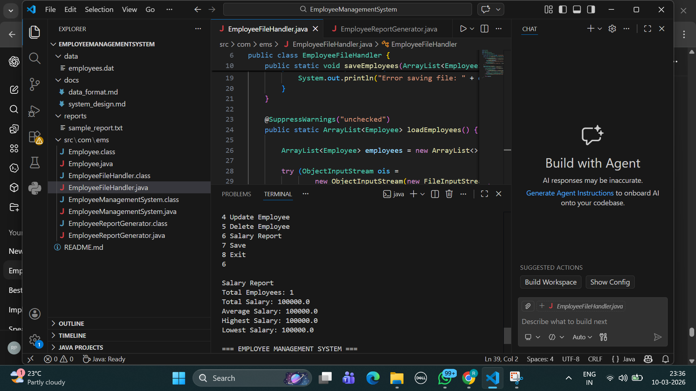
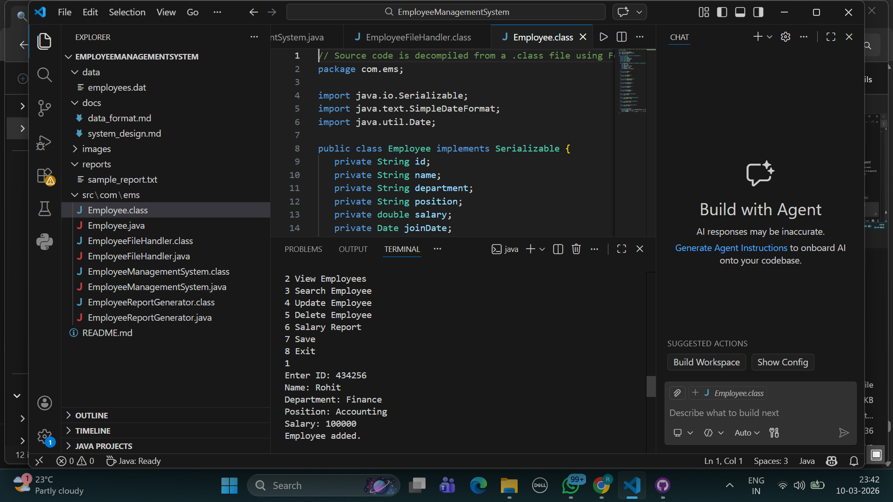
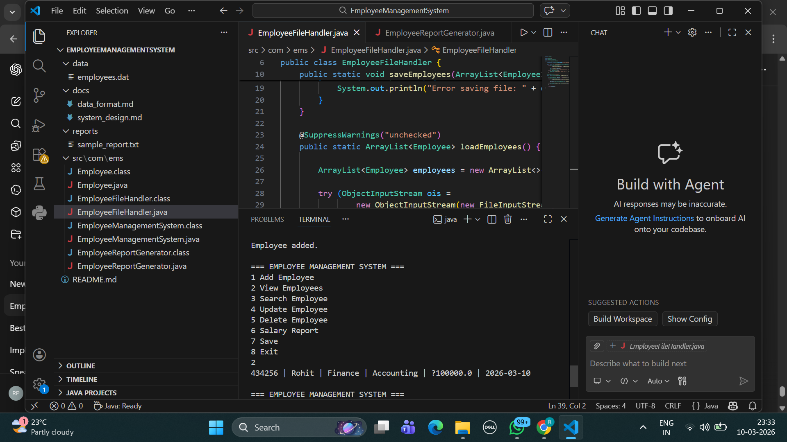

# Employee Management System

## Overview
The Employee Management System is a Java-based console application that manages employee records.  
It allows users to add, update, delete, search, and generate reports for employees.

The system stores employee data using Java Collections and persists the data using file handling.

## Features
- Add new employees
- View employee list
- Search employees by ID, name, or department
- Update employee details
- Delete employee records
- Generate salary reports
- Save and load employee data from files
- Exception handling for invalid input

## Technologies Used
- Java
- ArrayList
- HashMap
- File Handling (Serialization)
- Exception Handling

## Project Structure
# Employee Management System

## Project Output

### Main Menu

### Add Employee

### View Employees

